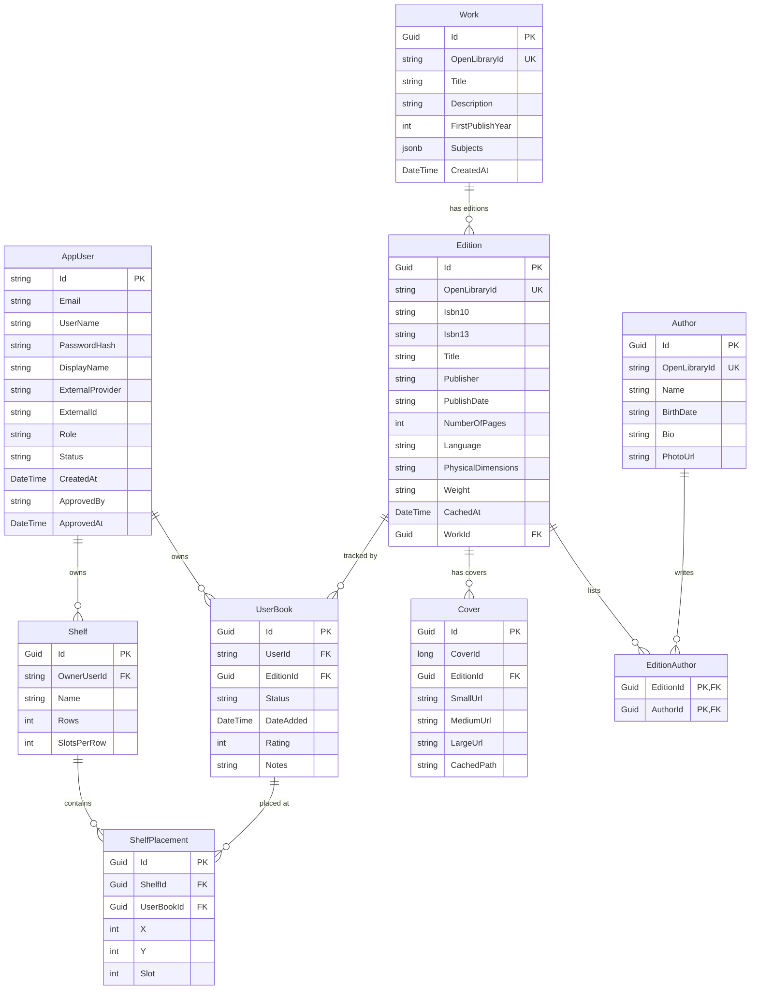

# Virtual Library — Entity-Relationship Diagram
This diagram is the source of truth for the relational schema managed by `AppDbContext`
in `VirtualLibrary.Api/Data/AppDbContext.cs`. Render it with any Mermaid-aware viewer
(e.g. GitHub, the [Mermaid Live Editor](https://mermaid.live), or VS Code's Markdown preview).

## Notes
* `AppUser` inherits from ASP.NET Core Identity's `IdentityUser` — additional identity
  tables (`AspNetRoles`, `AspNetUserClaims`, `AspNetUserLogins`, `AspNetUserTokens`,
  `AspNetUserRoles`) exist in the database but are omitted here for readability.
* `UserBook` is unique on `(UserId, EditionId)`.
* `Work.Subjects` is stored as PostgreSQL `jsonb` via an EF Core value conversion.
* `AppUser.Role` and `AppUser.Status` are persisted as strings (`HasConversion<string>()`).
